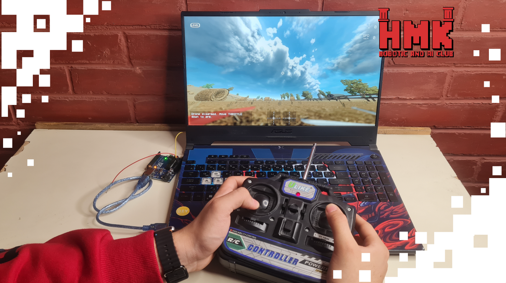

# 🛩️ Drone-Simulator

## 📅 Project Timeline & Context

- **Event:** FMEE 2025 – **AI & Robotics Club** Open Day
- **Date:** November 10–11–12, 2025

---

## 💡 Project Overview
This project demonstrates how to interface a **FlySky RC controller** with **Liftoff** using inexpensive hardware.  
The Arduino reads **PWM channel signals** from the receiver, maps them to joystick-style inputs, and sends them to the PC—allowing realistic flight practice using your actual controller.

---

## ⚙️ Components and Parts Used

### 🛠 Hardware
- **Arduino Uno**  
- **FlySky Receiver (e.g., FS-iA6B)**  
- **FlySky Transmitter (FS-i6 / FS-i6X)**  
- **Jumper wires**  
- **USB cable** (Arduino → PC)

---

## 💻 Software and Tools Used
- **Arduino IDE** – reading PWM & mapping channel values  
- **Liftoff Drone Simulator** – training environment  
- **Serial joystick / custom input mapping tools**

---

## 👨‍💻 Contributors

- **Jolian Wassof** [LinkedIn](https://www.linkedin.com/in/jolian-wassof-85512b375/) 

---

## 🚀 Future Improvements
- Add support for more transmitter channels  
- Build a dedicated **HID joystick firmware**  
- Create a **3D-printed enclosure**  
- Add calibration and signal smoothing

---

## 📸 Demo
**Coming soon!**

---

**Made with ❤️ using Arduino, FlySky gear, and Liftoff.**
